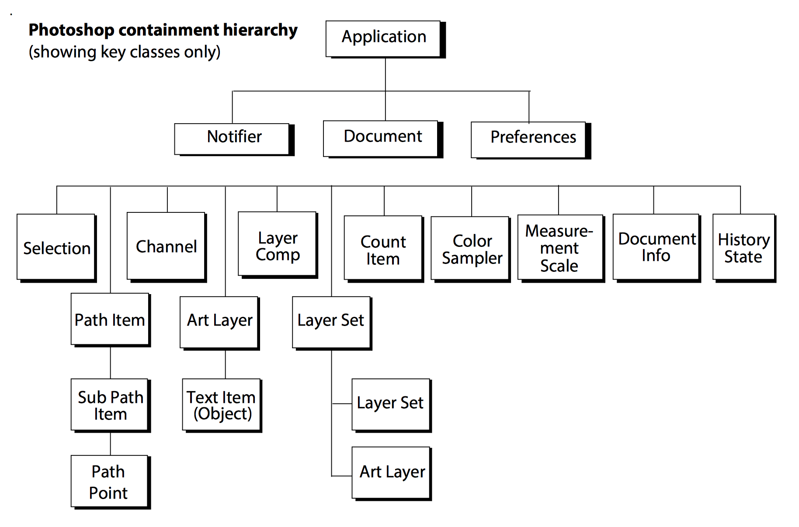
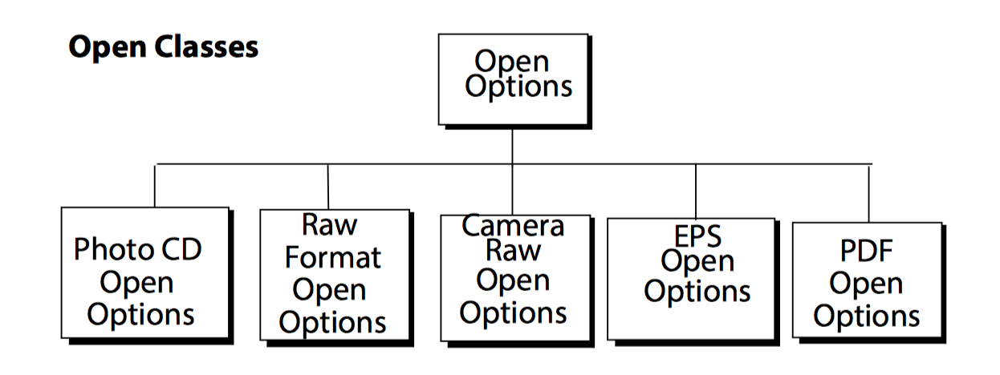
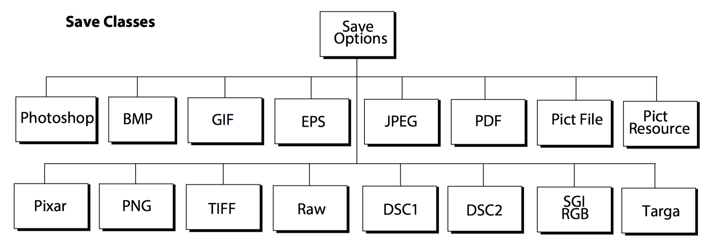

# CEP 笔记

CEP (Common Extensibility Platform)

## Extension Type

- Panel

- ModalDialog

- Modeless

- Custom

## Browser Features supported by CEP

Http Cookie

- Session Cookies - Temporary in-memory cookie which will expire and disappear when user closes extension

- Persistent Cookies - No expiry date or validity interval, stored in user's file system

## Startup Scripts

On startup, Photoshop executes all .jsx files that it finds in the startup folders.

- Windows: `C:\Program Files\Common Files\Adobe\Startup Scripts CC\Adobe Photoshop`

- MacOS: `C:\Program Files\Common Files\Adobe\Startup Scripts CC\Adobe Photoshop`

## Containment hierarchy

```
Application
     |
     - Documents collection
               |
               - Document 
               |
               - Document
               |      |
               ...    - ArtLayers collection
                      |
                      - HistoryStates collection
                      |
                      - Layers collection
                      |
                      - Layersets collection
                      |
                      - Channels collection
```



- `Art Layer` 对应的是有图片的层

- `Layer set` 对应的是Layer Group

## SolidColor Class


## Script Tips

- creating new objects in script: `add()`

  ```[js]
  // create document
  app.documents.add();

  // create artLayer
  document.artLayers.add();
  ```

- setting the active object

  ```[js]
  // Create 2 documents
  var docRef = app.documents.add(4, 4);
  var otherDocRef = app.documents.add (4, 6);

  //make docRef the active document
  app.activeDocument = docRef;
  //here you would include command statements
  //that perform actions on the active document. Then, you could
  //make a different document the active document
  docRef.activeLayer = docRef.layers[0];

  //use the activeDocument property of the Application object to
  //bring otherDocRef front-most as the new active document
  app.activeDocument = otherDocRef;
  ```

- open document: `open()`

  ```
  var fileRef = File(app.path + "/Samples/test.psd");
  var docRef = app.open(fileRef);
  ```

  打开文件选项:

  

  ```[js]
  // Set the ruler units to pixels
  var originalRulerUnits = app.preferences.rulerUnits;
  app.preferences.rulerUnits = Units.PIXELS;

  // Get a reference to the file that we want to open
  var fileRef = new File(“/c/pdffiles/myfile.pdf”);

  // Create a PDF option object
  var pdfOpenOptions = new PDFOpenOptions;
  pdfOpenOptions.antiAlias = true;
  pdfOpenOptions.mode = OpenDocumentMode.RGB;
  pdfOpenOptions.resolution = 72;
  pdfOpenOptions.page = 3;
  // open the file
  app.open( fileRef, pdfOpenOptions );

  // restore unit settings
  app.preferences.rulerUnits = originalRulerUnits
  ```

- save document:

  ```[js]
  app.documents.add( 4, 4 );
  jpgFile = new File( "/Temp001.jpeg" );
  jpgSaveOptions = new JPEGSaveOptions();
  jpgSaveOptions.embedColorProfile = true;
  jpgSaveOptions.formatOptions = FormatOptions.STANDARDBASELINE;
  jpgSaveOptions.matte = MatteType.NONE;
  jpgSaveOptions.quality = 1;
  app.activeDocument.saveAs(jpgFile, jpgSaveOptions, true, Extension.LOWERCASE);
  ```

  保存文件选项：

  

- create an ArtLayer object:

  ```[javascript]
  //make a new document
  app.documents.add();

  // Create a new art layer at the beginning of the current document
  var layerRef = app.activeDocument.artLayers.add();
  layerRef.name = "MyBlendLayer";
  layerRef.blendMode = BlendMode.NORMAL;

  // Select all so we can apply a fill to the selection
  app.activeDocument.selection.selectAll;

  // Create a color to be used with the fill command
  var colorRef = new SolidColor;
  colorRef.rgb.red = 255;
  colorRef.rgb.green = 100;
  colorRef.rgb.blue = 0;

  // Now apply fill to the current selection
  app.activeDocument.selection.fill(colorRef);
  ```

- create a Layer Set object:

  ```[javascript]
  // make a new document and a layer in the document
  app.documents.add();
  app.activeDocument.artLayers.add();

  // Get a reference to the first layer in the document
  var layerRef = app.activeDocument.layers[0];

  // Create a new LayerSet (it will be created at the beginning of the
  // document)
  var newLayerSetRef = app.activeDocument.layerSets.add();

  // Move the new layer to after the first layer
  newLayerSetRef.move(layerRef, ElementPlacement.PLACEAFTER);
  ```

- place the layer during the duplication method

  ```[javascript]
  var docRef = app.documents.add();
  docRef.artlayers.add();

  var layerSetRef = docRef.layerSets.add();
  var layerRef = docRef.artLayers[0].duplicate(layerSetRef, ElementPlacement.PLACEATEND);
  ```

- create a text item object:

  ```[javascript]
  var newLayerRef = docRef.artLayers.add();
  newLayerRef.kind = LayerKind.TEXT;

  newLayerRef.name = "Text Layer";

  var textItemRef = newLayerRef.textItem;
  textItemRef.contents = "Hello, World!";
  textItemRef.justification = Justification.LEFT;
  ```

- clipboard interaction

  clipboard commands of the *ArtLayer* and *Selection*

  - `copy`

  - `copy(merge parameter value)`

  - `cut`

  clipboard commands of the *Document*

  - `paste`

  - `paste(intoSelection parameter value)`

- history states

  ```[javascript]
   docRef = app.activeDocument;
   var savedState = docRef.activeHistoryState;
   docRef.artLayers[0].applyMotionBlur( 20, 20 );
   docRef.activeHistoryState = savedState;

   // 清除历史记录
   // app.purge(PurgeTarget.HISTORYCACHES);
  ```

- rulerUnits && typeUnits

  ```[javascript]
  startRulerUnits = app.preferences.rulerUnits;
  startTypeUnits = app.preferences.TypeUnits;
  startDisplayDislogs = app.displayDialogs;

  // change settings
  app.preferences.rulerUnits = Units.INCHES;
  app.preferences.typeUnits = TypeUnits.PIXELS;
  app.displayDialogs = DialogModes.NO;

  var docWidthInInches = 4;
  var docHeightInInches = 2;
  var resolution = 72;
  var docName = "Hello world";

  if (app.documents.length === 0)
     app.documents.add(docWidthInInches, docHeightInInches, resolution, docName);

  // restore beginning preferences
  app.preferences.rulerUnits = startRulerUnits;
  app.preferences.typeUnits = startTypeUnits;
  app.displayDialogs = startDisplayDislogs;
  ```

