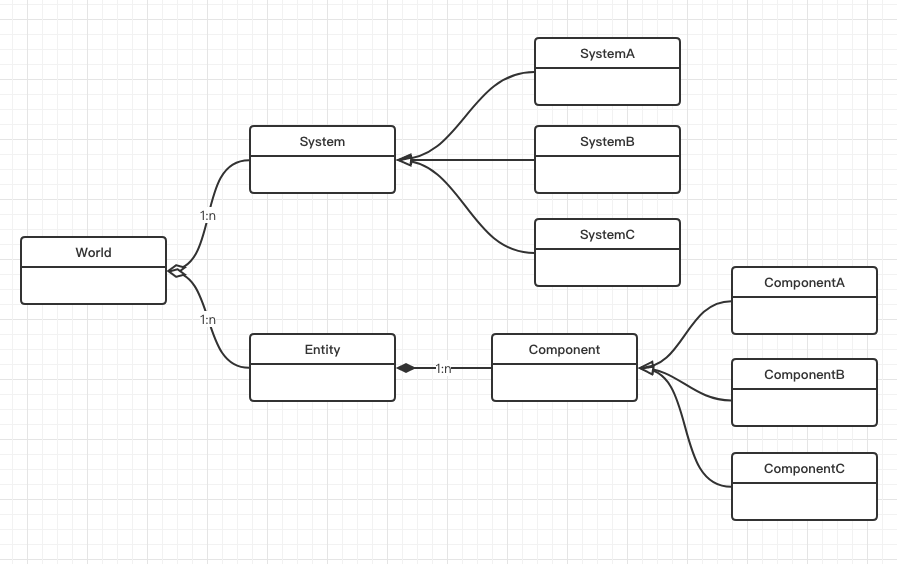

# ECS 架构概述

## 0x00 何为ECS架构

***ECS***，即 Entity-Component-System（实体-组件-系统） 的缩写，其模式遵循[组合优于继承](https://en.wikipedia.org/wiki/Composition_over_inheritance)原则，游戏内的每一个基本单元都是一个**实体**，每个**实体**又由一个或多个**组件**构成，每个**组件**仅仅包含代表其特性的数据（即在组件中没有任何方法），例如：移动相关的组件`MoveComponent`包含速度、位置、朝向等属性，一旦一个实体拥有了`MoveComponent`组件便可以认为它拥有了移动的能力，**系统**便是来处理拥有一个或多个相同**组件**的**实体**集合的工具，其只拥有行为（即在系统中没有任何数据），在这个例子中，处理移动的**系统**仅仅关心拥有移动能力的**实体**，它会遍历所有拥有`MoveComponent`**组件**的**实体**，并根据相关的数据（速度、位置、朝向等），更新实体的位置。

**实体**与**组件**是一个一对多的关系，**实体**拥有怎样的能力，完全是取决于其拥有哪些**组件**，通过动态添加或删除**组件**，可以在（游戏）运行时改变**实体**的行为。

## 0x01 ECS基本结构

一个使用ECS架构开发的游戏基本结构如下图所示：

先有一个World，它是**系统**和**实体**的集合，而**实体**就是一个ID，这个ID对应了**组件**的集合。**组件**用来存储游戏状态并且没有任何行为，**系统**拥有处理**实体**的行为但是没有状态。

## 0x02 详解ECS中实体、组件与系统 

### 1. 实体

实体只是一个概念上的定义，指的是存在你游戏世界中的一个独特物体，是一系列组件的集合。为了方便区分不同的实体，在代码层面上一般用一个ID来进行表示。所有组成这个实体的组件将会被这个ID标记，从而明确哪些组件属于该实体。由于其是一系列组件的集合，因此完全可以在运行时动态地为实体增加一个新的组件或是将组件从实体中移除。比如，玩家实体因为某些原因（可能陷入昏迷）而丧失了移动能力，只需简单地将移动组件从该实体身上移除，便可以达到无法移动的效果了。

**样例**：

- Player(Position, Sprite, Velocity, Health)
- Enemy(Position, Sprite, Velocity, Health, AI)
- Tree(Position, Sprite)

*注：括号前为实体名，括号内为该实体拥有的组件*

### 2. 组件

一个组件是一堆数据的集合，可以使用C语言中的结构体来进行实现。它没有方法，即不存在任何的行为，只用来存储状态。一个经典的实现是：每一个组件都继承（或实现）同一个基类（或接口），通过这样的方法，我们能够非常方便地在运行时动态添加、识别、移除组件。每一个组件的意义在于描述实体的某一个特性。例如，`PositionComponent`（位置组件），其拥有`x`、`y`两个数据，用来描述实体的位置信息，拥有`PositionComponent`的实体便可以说在游戏世界中拥有了一席之地。当组件们单独存在的时候，实际上是没有什么意义的，但是当多个组件通过系统的方式组织在一起，才能发挥出真正的力量。同时，我们还可以用空组件（不含任何数据的组件）对实体进行标记，从而在运行时动态地识别它。如，`EnemyComponent`这个组件可以不含有任何数据，拥有该组件的实体被标记为“敌人”。

**样例**：

- PositionComponent(x, y)
- VelocityComponent(X, y)
- HealthComponent(value)
- PlayerComponent()
- EnemyComponent()

*注：括号前为组件名，括号内为该组件拥有的数据*

### 3. 系统

## 0x03 ECS实现

