# A* 算法介绍

原文：https://www.redblobgames.com/pathfinding/a-star/introduction.html

在游戏中，我们经常想找从一个位置到另一个位置的路径。我们不仅试图找到其中最短的路径，还希望考虑到时间成本。


要找到此路径，我们可以使用图搜索算法，该算法在将地图表示为图（Graph）这种数据结构时起作用。**A\*** 是其中一个非常流行的选择。**广度优先搜索（BFS）** 是最简单的图搜索算法，因此，我们从它开始介绍，一步步深入到A\*算法。

## 地图表示法

研究算法时，要做的第一件事是理解**数据**。输入什么？输出是什么？

输入：包括 A* 在内的图搜索算法均以“图”作为输入。图是由一组位置（“节点”）和它们之间的连接（“边”）组成。下图为我为 A* 算法的输入：


A* 算法只看图的数据，看不到其他任何内容。它不知道某物是在室内还是室外，或者是房间还是门道，又或是面积有多大。它只能看到图！它不知道这张地图和另一张地图之间的区别。

输出：A* 找到的一条由图中节点以及边组成的路径。边是一个抽象的数学概念。A* 会告诉你从一个位置移动到另一个位置，但是不会告诉你如何移动过去。请记住，它对房间还是门一无所知；它能看到的所有信息只有图的数据。你必须决定由 A* 返回的边是指从一个图块单元（Tile）移动到另一个图块单元，还是走直线过去，或者打开一扇门，又或者沿着弯曲的路线游泳或奔跑过去。

权衡：对于任意给定的游戏地图，存在很多不同的方法创建出图（称为寻路图）给到 A* 进行计算。上面的地图使大多数门成为节点。如果我们将门口变成边怎么办？如果我们使用寻路网格怎么办？


寻路图不必与你的游戏地图使用相同的图。基于网格的游戏地图也可以使用非网格寻路图，反之亦然。图中的节点越少 A* 运行的越快；网格通常更便于使用，但它会导致图有很多节点。本文涵盖 A* 算法，但不涉及图的设计；有关图的更多信息，请参见我的[其他页面](http://theory.stanford.edu/~amitp/GameProgramming/MapRepresentations.html)。本文剩余部分，我将使用网格，因为它使概念的可视化更加容易。

## 算法

有很多算法来处理图的数据，我将一一介绍它们：

- **广度优先搜索（BFS）**

    平等地探索各个方向。这是一个非常有用的算法，不仅常用于寻路，还常用于过程式（Procedural）图生成、流场（Flow Field）寻路、距离图（Distance Map）和其他类型的图分析。

- **Dijkstra算法**

    让我们确定要探索的路径的优先级。有别于平等地探索各个方向，它更倾向于探索成本较低的路线。我们可以为道路设置较低的成本以鼓励在道路上移动，为森林分配较高的成本以避开森林，为敌人分配更高的成本，以组织靠近敌人等。当移动的成本多变时，我们将使用它来代替广度优先搜索。

- **A\***

    A* 是 Dijkstra 算法的修改版本，它针对单个目标进行了优化。Dijkstra 的算法可以找到任意目标的路径；而 A* 算法用来查找到某一个目标位置或几个位置中最接近的位置的路径。它优先考虑的是看起来更接近目标的路径。

我将从最简单的广度优先搜索开始，然后一次添加一个功能，将其转换为 A*

## 广度优先搜索（Breadth First Search）

所有这些算法的关键思想是，我们跟踪一个被称为边界的扩张环。在网格上，此过程有时称为“洪水填充（Flood fill）”，但相同的技术也适用于非网格。下图展示了这一过程：


如何实现这个过程呢？重复下面这些步骤，直到边界为空：

1. 从边界列表中选择并移除一个节点
2. 通过寻找它的相邻节点来扩张它。任意一个尚未寻找过的相邻节点，都要将其添加到边界列表中，同时将其添加到寻找过的列表中

让我们近距离看一下。图块按照我们访问它们的顺序编号。逐步查看扩张过程：


仅仅只需要10行代码（Python）便可以做到：

```python
frontier = Queue()
frontier.put(start)
visited = {}
visited[start] = True

while not frontier.empty():
    current = frontier.get()
    for next in graph.neighbors(current):
        if next not in visited:
            frontier.put(next)
            visited[next] = True
```

这个循环是本文所介绍的图搜索算法的本质，包括 A*。但是，我们如何找到最短的路径呢？循环实际上并没有构造路径；它仅告诉我们如何访问地图上的任意位置。这是因为，广度优先搜索不仅可以用于查找路径，还有很多其他用途。在本文中，我将展示它如何用于塔防游戏中，除此之外，它还可以用于距离图，过程式图生成，以及许多其他功能。这里由于我们要使用它来查找路径，所以让我们修改循环以跟踪每个访问过的位置的来源（从哪个节点访问到它），并将访问过的集合重命名为`came_from`表（表的键是访问过集合）

```python
frontier = Queue()
frontier.put(start)
came_from = {}
came_from[start] = None

while not frontier.empty():
    current = frontier.get()
    for next in graph.neighbors(current):
        if next not in came_from:
            frontier.put(next)
            came_from[next] = current
```

现在，每一个位置的`came_from`都指向它们的来源。这些就像泥土路上的“面包屑”，它们足以重建整条路径。


重建路径的代码很简单：遵循箭头的方向**反向**从目标点到起点。路径是一系列边，但通常存储节点更容易：

```python
current = goal
path = []
while current != start:
    path.append(current)
    current = came_from[current]
path.append(start) # optional
path.reverse() # optional
```

这是最简单的寻路算法。它不仅适用于上图所示的网格组成的地图，还适用于任何类型的图数据结构。在地牢中，图中的位置可以是房间，而图中的边则是位于它们之间的走道。在平台游戏中，图中的位置可以是游戏世界中的位置，而图中的边，它们是可能的动作，例如向左移动，向右移动，向上跳跃，向下跳跃。通常，将图视为状态和更改状态的动作。[这里](http://theory.stanford.edu/~amitp/GameProgramming/MapRepresentations.html)有更多关于地图表示法的文章。在本文的其余部分，我将继续使用网格图示例，并探讨为什么你可能会使用广度优先搜索的变体。

## 提前退出（Early exit）

我们已经找到了从一个位置到其他所有位置的路径。然而通常我们并不需要所有路径；我们只需要从一个位置到另一个位置的路径。因此，一旦我们找到目标位置后，就可以停止扩张边界。如下图所示：

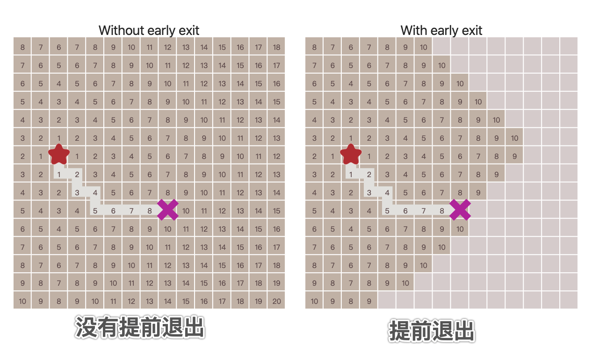

下面的代码是非常直观的：

```python
frontier = Queue()
frontier.put(start)
came_from = {}
came_from[start] = None

while not frontier.empty():
    current = frontier.get()

    if current == goal:
        break

    for next in graph.neighbors(current):
        if next not in came_from:
            frontier.put(next)
            came_from[next] = current
```

## 移动成本（Movement Costs）

到目前为止，我们假设每一次移动“成本”是相同的。在某些寻路方案中，不同类型的移动会有不同的成本。例如，在《文明》中，穿越平原或沙漠可能需要1个移动点，但穿越森林或丘陵可能需要5个移动点。在本文开头的地图中，穿越水域的成本是穿越草地成本的10倍。另一个示例是，网格上沿着对角线运动的成本要高于沿着轴线运动。我们希望探路者将这些成本考虑在内。让我们比较一下从开始到目标点“移动的步数”和移动的“距离”：

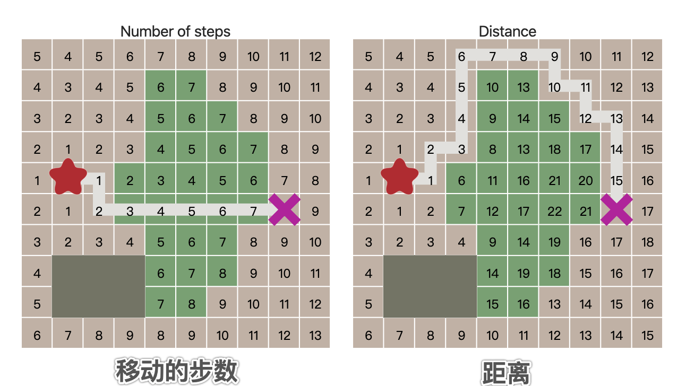

为此，我们需要 **Dijkstra 算法**。与广度优先搜索有何不同呢？我们需要追踪移动的成本，因此，让我们添加一个新的变量`cost_so_far`，来记录从起始位置开始的总移动成本。在决定如何评估选择位置时，我们要将移动成本考虑在内。让我们将上文中的队列（queue）改成优先队列（priority queue）。不太明显的是，在这个过程中，我们可能会通过不同的成本访问同一个位置多次（路径不同），因此我们需要稍微改变一下逻辑。不再是将从未访问过的位置添加到边境队列中，而是将到达该位置的路径成本比之前记录的路径成本更满意的位置添加到队列中。

```python
frontier = PriorityQueue()
frontier.put(start, 0)
came_from = {}
cost_so_far = {}
came_from[start] = None
cost_so_far[start] = 0

while not frontier.empty():
    current = frontier.get()

    if current == goal:
        break

    for next in graph.neighbors(current):
        new_cost = cost_so_far[current] + graph.cost(current, next)
        if next not in cost_so_far or new_cost < cost_so_far[next]:
            cost_so_far[next] = new_cost
            priority = new_cost
            frontier.put(next, priority)
            came_from[next] = current
```

使用优先队列来代替普通队列会改变边界扩张的方式。等高线是直观看到这种情况的一种方式：

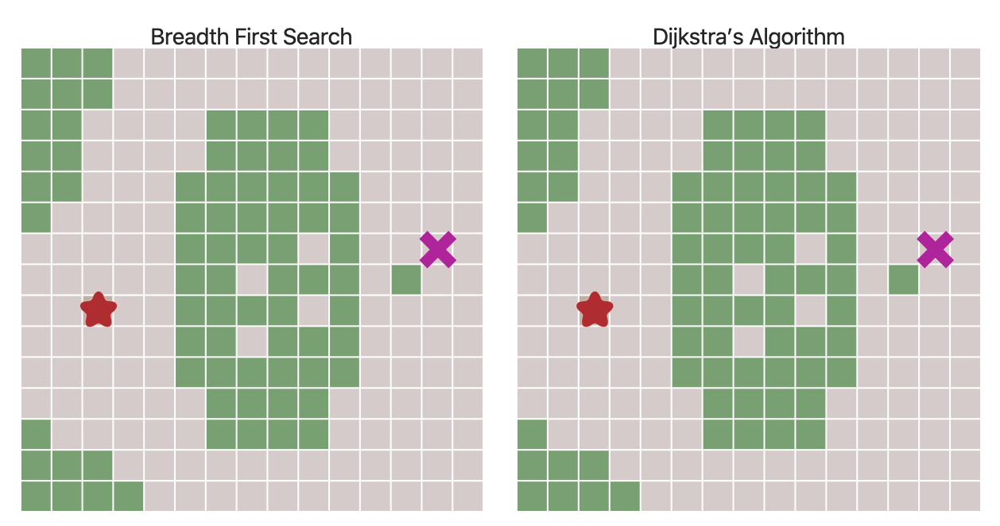

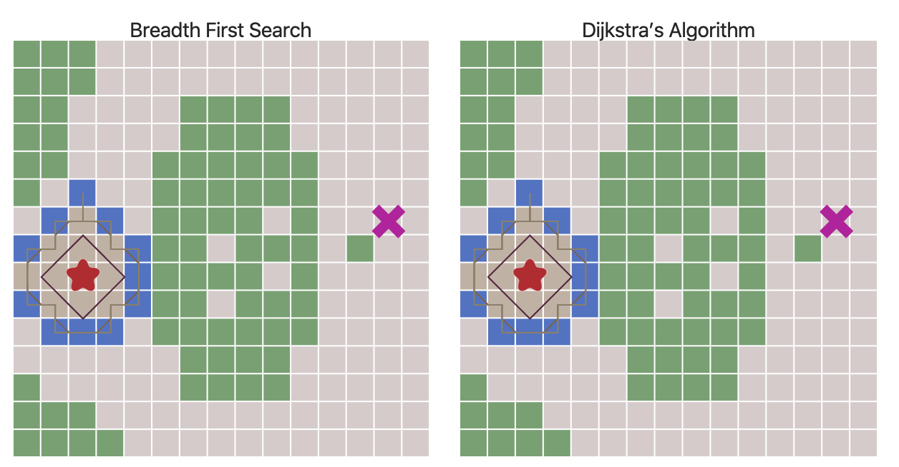

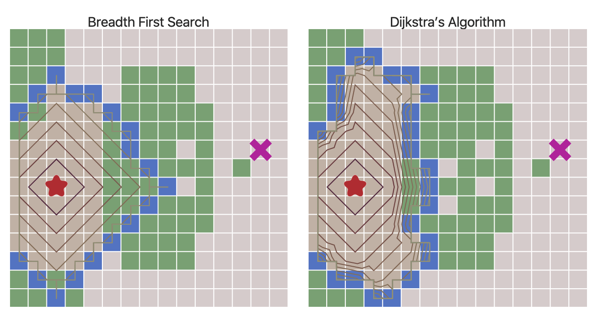

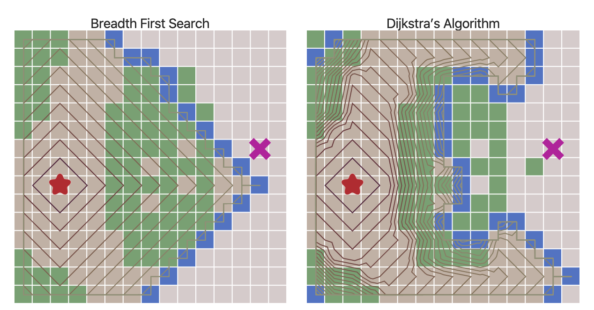

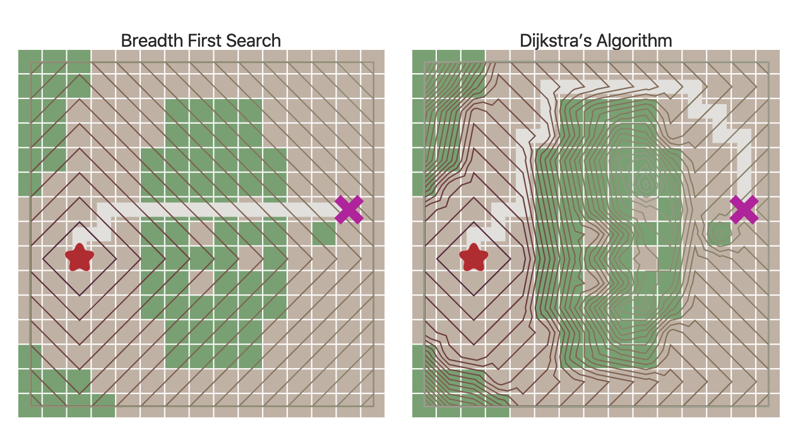

移动成本不再都是1使我们不仅可以网格，还可以探索更多有趣的图。在本文开头给出的地图中，移动成本是根据房间与房间之间的距离进行计算的。移动成本也可用于根据于敌人或盟友的距离远近来避开或偏爱某些地区。

代码实现注意事项：我们希望通过优先队列保证每次返回成本最小的位置。在上文实现中，我展示了通过使用 Python 中的`PriorityQueue`，它使用 heapq 算法来返回队列中的最小值。在 C++ 中可以使用`std::priority_queue`配置优先返回最小值。另外，本文展示的 Dijkstra 算法和 A* 算法与一般算法教科书上版本不同，它们与所谓的“统一费用搜索（Uniform Cost Search）更加接近。我会在相关实现部分描述其差异。

## 启发式搜索（Heuristic Search）

借助广度优先搜索和 Dijkstra 算法，边界将向各个方向扩展。如何你要查找大多数位置或所有位置之间的路径，这是一个合理的选择。但是，更常见的情况是我们只需要找到一个位置到另一个位置之间的路径。因此，让我们将边界朝向目标扩展，而不是全方向扩展。首先，我们将定一个启发式函数（Heuristic Function），它将告诉我们离目标的远近：

```python
def heuristic(a, b):
    # 网格上的曼哈顿距离
    # Manhattan distance on a square grid
    return abs(a.x - b.x) + abs(a.y - b.y)
```

>
>译者补充：
>
>**曼哈顿距离**
>
>我们可以定义**曼哈顿距离**的正式意义为**L1-距离**或**城市区块距离**，也就是在欧几里得空间的固定直角坐标系上两点所形成的线段对轴产生的投影的距离总和。
>
>例如在平面上，坐标（x1, y1）的点P1与坐标（x2, y2）的点P2的曼哈顿距离为：
>
>|x1 - x2| + |y1 - y2|
>
>要注意的是，曼哈顿距离依赖座标系统的旋转，而非系统在座标轴上的平移或映射。


在 Dijkstra 算法中，我们使用从起点开始的实际距离来进行优先级队列的排序。相反，在**贪心最佳优先搜索中（Greedy Best First Search）**中，我们将使用到目标位置的估计距离来进行优先队列排序。距离目标位置最近的位置最先进行探索。下面代码使用了Dijkstra 算法中的优先队列，但没有使用`cost_so_far`表：

```python
frontier = PriorityQueue()
frontier.put(start, 0)
came_from = {}
came_from[start] = None

while not frontier.empty():
    current = frontier.get()

    if current == goal:
        break

    for next in graph.neighbors(current):
        if next not in came_from:
            priority = heuristic(goal, next)
            frontier.put(next, priority)
            came_from[next] = current
```

让我们一起看一下它的工作机制：

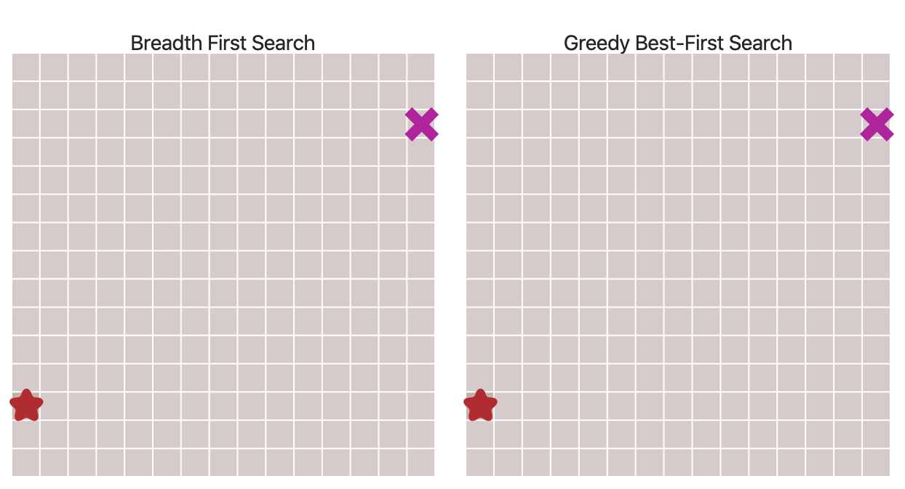


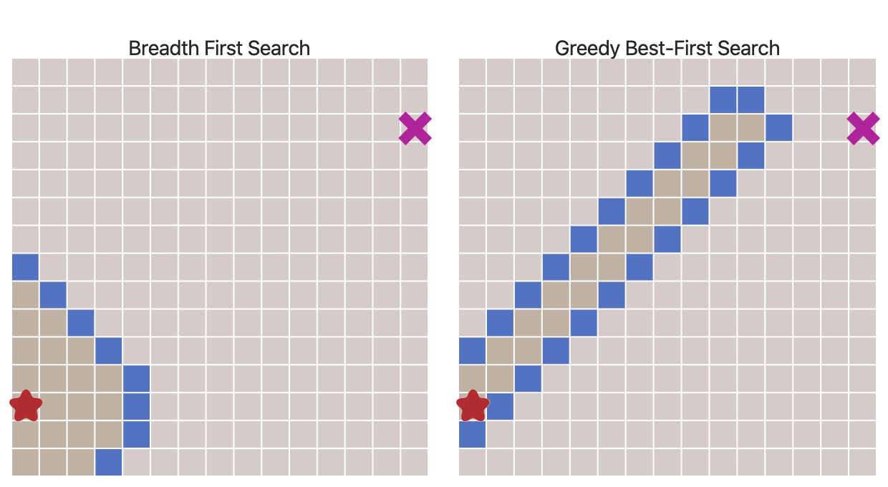

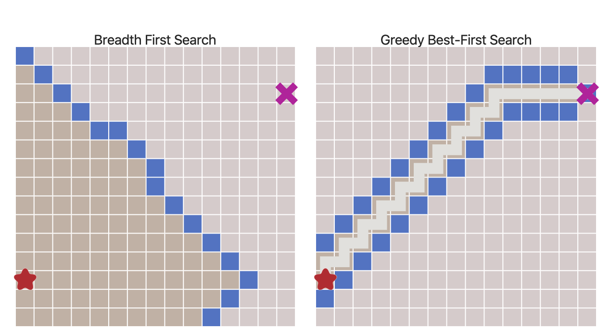

令人惊叹的效果！但是如果地图更复杂会发生什么呢？

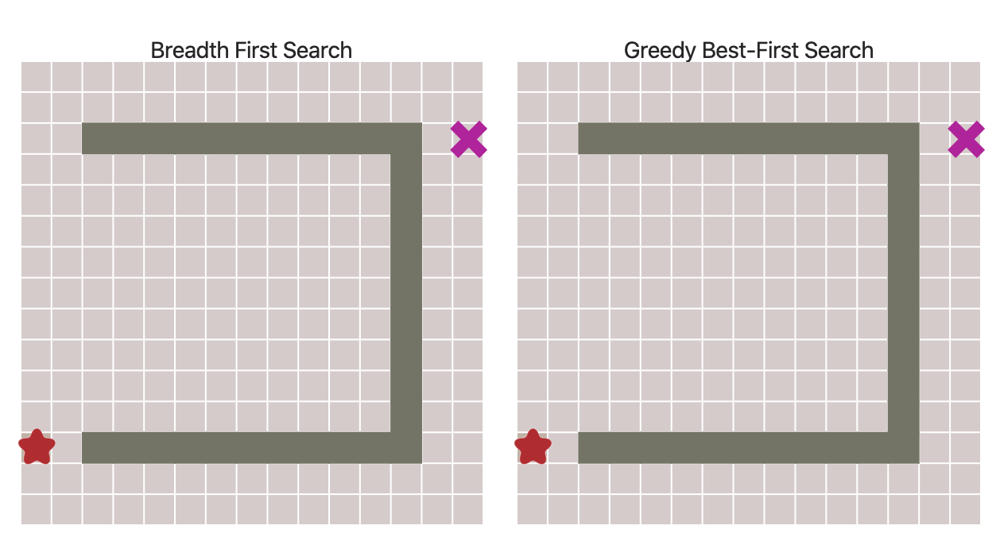

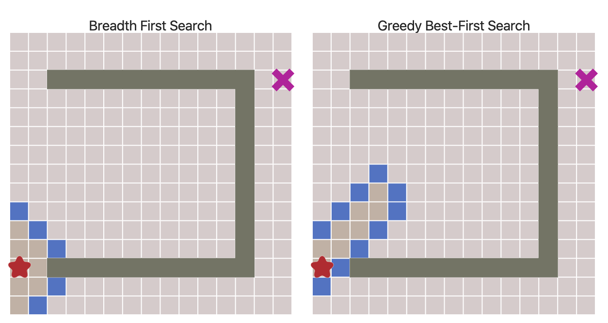

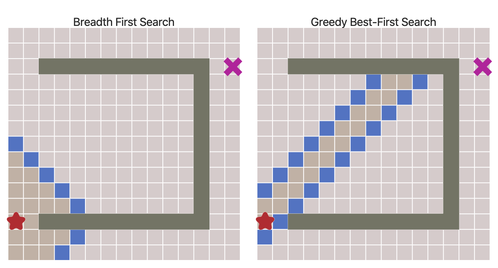

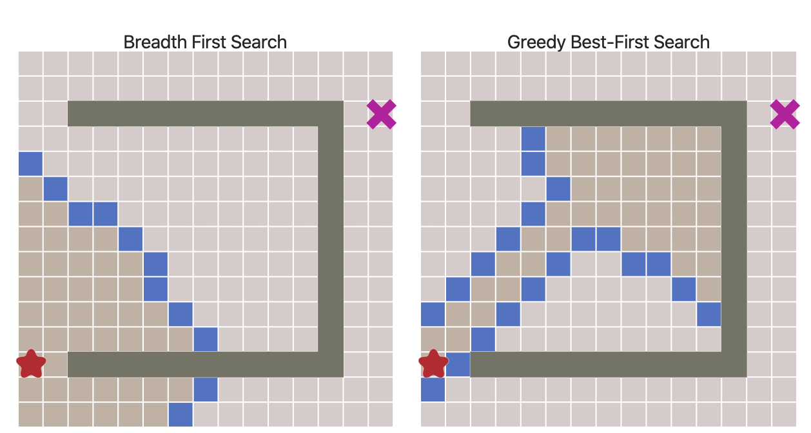

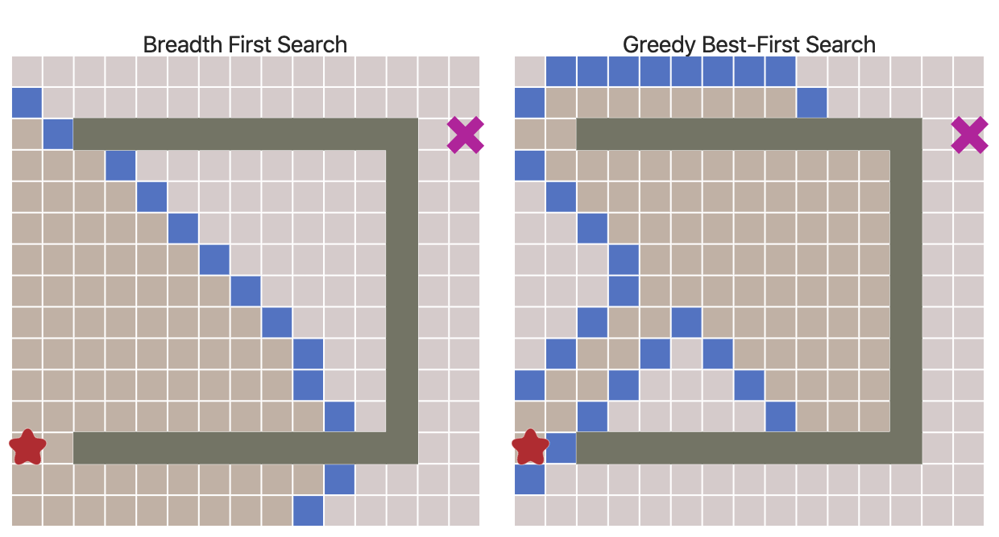

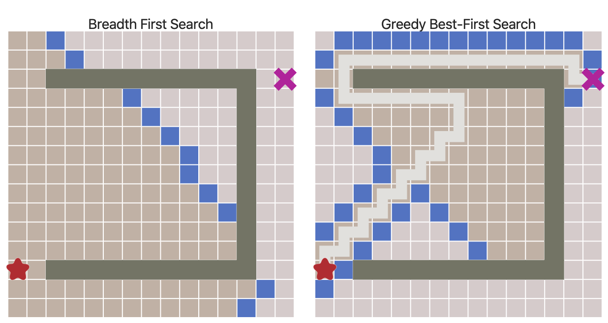

可以看出，这些路径并非最短的。因此，在没有大量障碍物的前提下，该算法的运行速度更快，但得到的路径却不尽人意。我们可以解决这个问题吗？当然可以

## A* 算法

Dijkstra 算法可以很好地找到最短路径，但却浪费了很多时间在探索各个没有可能地方向上。贪心最佳优先搜索在最可能地方向上进行探索，但可能找到的路径并不是最短路径。A* 算法同时使用从起点到目标的实际距离以及到目标的估计距离。

代码跟 Dijkstra 算法十分相似：

```python
frontier = PriorityQueue()
frontier.put(start, 0)
came_from = {}
cost_so_far = {}
came_from[start] = None
cost_so_far[start] = 0

while not frontier.empty():
    current = frontier.get()

    if current == goal:
        break

    for next in graph.neighbors(current):
        new_cost = cost_so_far[current] + graph.cost(current, next)
        if next not in cost_so_far or new_cost < cost_so_far[next]:
            cost_so_far[next] = new_cost
            priority = new_cost + heuristic(goal, next)
            frontier.put(next, priority)
            came_from[next] = current
```

对比：

- Dijkstra 算法计算到起点的距离
- 贪心最佳优先搜索预估到目标点的距离
- A* 使用的是这两个距离的和

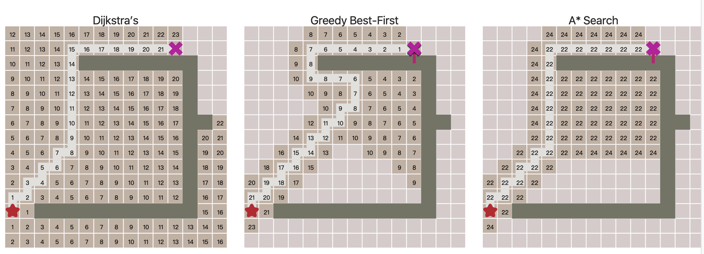

尝试在墙上开一个洞。你会发现，当贪心最佳优先搜索找到正确的路径时，A* 也能找到它，并探索相同的区域。当贪心最佳优先搜索找到错误的路径（更长的路径时），A* 会找到正确的路径，就像 Dijkstra 算法一样，但探索的区域却比它少很多。

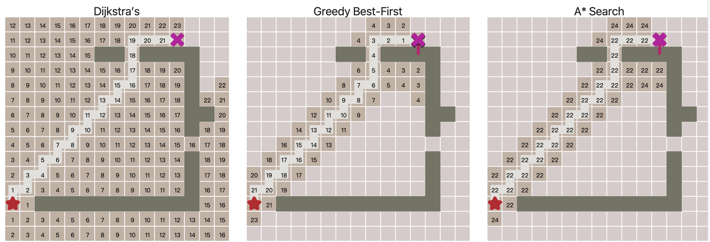

A* 是一个两全其美的算法。只要启发式算法不会高估距离，A* 就能找到最佳路径，就像 Dijkstra 那样。A* 使用启发式算法对节点进行重新排序，以便更大概率访问目标位置。

就是这样！这就是 A* 算法。

## 更多

>你准备好来实现它了吗？可以考虑考虑直接使用现有的库。如果你准备自己实现它，我会提供一个配套的[教程](https://www.redblobgames.com/pathfinding/a-star/implementation.html)，手把手向你展示如何实现图、队列以及寻路算法（使用Python、C++和C#）

那么你应该使用哪种算法用来在游戏地图上寻路呢？

如果你想要查找地图上任意一个位置到另一个位置的路径，那么请使用广度优先搜索（BFS）或 Dijkstra 算法。如果移动成本相同，则使用广度优先搜索；如果移动成本不同，则使用 Dijkstra 算法。

如果你要查找从一个位置到另一个位置，或者从一个位置到多个目标位置中最近的位置，请使用贪心最佳优先搜索算法或A*。在大多数情况下建议使用A*。当你使用贪心最佳优先算法时，请考虑使用带有“不可接受的”启发式算法的A*。

>译者补充：
>
>可接受的启发式
>
>在计算机科学中，特别是在与寻路相关的算法中，如果启发式函数从未过高估计达到目标的成本，即它估计从当前位置到达目标位置的成本不高于当前的可能的最低成本，则认为该函数是可接受的。

算法给出的结果是否为最佳路径？对于给定的图，广度优先搜索和 Dijkstra 算法能够保证找到最短路径，但贪心最佳优先算法不保证，对于 A* 来说，如果启发式算法给出的成本永远不大于真实的距离，那么它也是可以保证给出最短路径。随着启发式算法给出的成本越来越小，A* 退化成 Dijkstra 算法；随着启发式算法给出的成本越来越高，A* 退化成贪心最佳优先算法。

关于性能？最好的提高性能的办法是去除掉图中不必要的节点。如果使用的是网格，那么参考[这里](https://www.redblobgames.com/pathfinding/grids/algorithms.html)，减小图的大小有益于所有图搜索算法。之后，请尽可能使用最简单的算法；越简单的队列运行得越快。贪心最佳优先算法通常比 Dijkstra 算法运行速度快，但不一定得到最佳路径。A* 则可以满足绝大多数寻路需求。

对于不是地图的场景呢？我在这里展示的都是地图是因为我认为使用地图更容易理解算法的工作原理。但是，这些图搜索算法可以用于任意类型的图，不仅仅是游戏地图，而且我尝试以独立于 2d 网格的方式来展示算法代码。地图上的移动成本对应为图数据结构里边的权重。启发式算法不易转换到任意地图上；你必须为每一种图设计单独的启发式算法。对于平面地图来说，距离是一个不错的选择，这也是为什么我在本文中选择它。

我[这里](http://theory.stanford.edu/~amitp/GameProgramming/)有很多关于寻路的文章。请记住，图搜索只是你所需要的一部分。A* 本身无法处理比如协作移动、越过障碍物、改变地图、避开危险区域、编队、转弯、对象数量、动画、平滑移动等很多其他主题的事情。

本文翻译自 [Red Blob Games](https://www.redblobgames.com/)，原文虽然是英文，但上面有更多可交互的元素，并且图片大部分都是动画，更利于学习和理解，请有能力阅读的同学一定要看一下原文，该博客还有很多游戏开发相关的算法介绍，值得反复阅读！