# A* 算法介绍

原文：https://www.redblobgames.com/pathfinding/a-star/introduction.html

在游戏中，我们经常想找从一个位置到另一个位置的路径。我们不仅试图找到其中最短的路径，还希望考虑到时间成本。

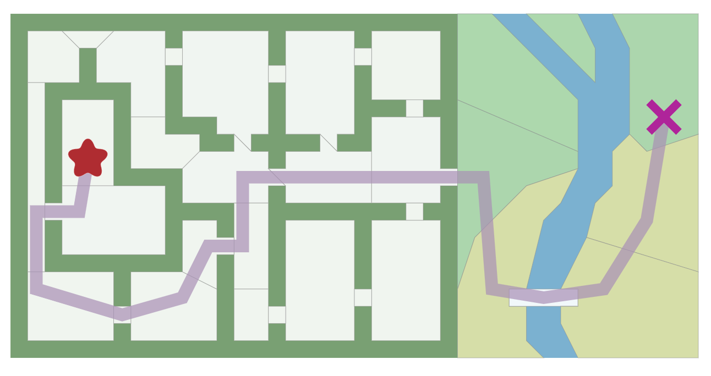

要找到此路径，我们可以使用图搜索算法，该算法在将地图表示为图（Graph）这种数据结构时起作用。**A\*** 是其中一个非常流行的选择。**广度优先搜索（BFS）** 是最简单的图搜索算法，因此，我们从它开始介绍，一步步深入到A\*算法。

## 地图表示法

研究算法时，要做的第一件事是理解**数据**。输入什么？输出是什么？

输入：包括 A* 在内的图搜索算法均以“图”作为输入。图是由一组位置（“节点”）和它们之间的连接（“边”）组成。下图为我为 A* 算法的输入：

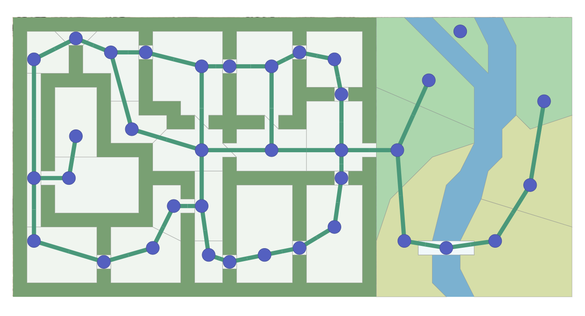

A* 算法只看图的数据，看不到其他任何内容。它不知道某物是在室内还是室外，或者是房间还是门道，又或是面积有多大。它只能看到图！它不知道这张地图和另一张地图之间的区别。

输出：A* 找到的一条由图中节点以及边组成的路径。边是一个抽象的数学概念。A* 会告诉你从一个位置移动到另一个位置，但是不会告诉你如何移动过去。请记住，它对房间还是门一无所知；它能看到的所有信息只有图的数据。你必须决定由 A* 返回的边是指从一个图块单元（Tile）移动到另一个图块单元，还是走直线过去，或者打开一扇门，又或者沿着弯曲的路线游泳或奔跑过去。

权衡：对于任意给定的游戏地图，存在很多不同的方法创建出图（称为寻路图）给到 A* 进行计算。上面的地图使大多数门成为节点。如果我们将门口变成边怎么办？如果我们使用寻路网格怎么办？

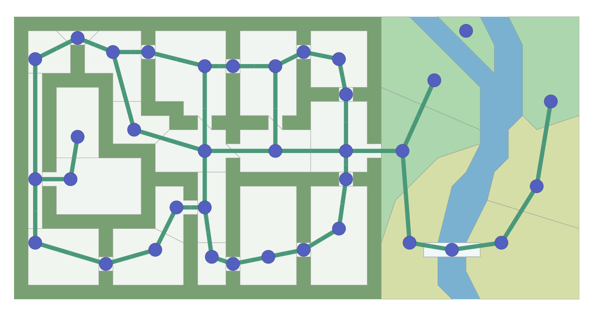

寻路图不必与你的游戏地图使用相同的图。基于网格的游戏地图也可以使用非网格寻路图，反之亦然。图中的节点越少 A* 运行的越快；网格通常更便于使用，但它会导致图有很多节点。本文涵盖 A* 算法，但不涉及图的设计；有关图的更多信息，请参见我的[其他页面](http://theory.stanford.edu/~amitp/GameProgramming/MapRepresentations.html)。本文剩余部分，我将使用网格，因为它使概念的可视化更加容易。

## 算法

有很多算法来处理图的数据，我将一一介绍它们：

- **广度优先搜索（BFS）**

    平等地探索各个方向。这是一个非常有用的算法，不仅常用于寻路，还常用于过程式（Procedural）图生成、流场（Flow Field）寻路、距离图（Distance Map）和其他类型的图分析。

- **Dijkstra算法**

    让我们确定要探索的路径的优先级。有别于平等地探索各个方向，它更倾向于探索成本较低的路线。我们可以为道路设置较低的成本以鼓励在道路上移动，为森林分配较高的成本以避开森林，为敌人分配更高的成本，以组织靠近敌人等。当移动的成本多变时，我们将使用它来代替广度优先搜索。

- **A\***

    A* 是 Dijkstra 算法的修改版本，它针对单个目标进行了优化。Dijkstra 的算法可以找到任意目标的路径；而 A* 算法用来查找到某一个目标位置或几个位置中最接近的位置的路径。它优先考虑的是看起来更接近目标的路径。

我将从最简单的广度优先搜索开始，然后一次添加一个功能，将其转换为 A*

## 广度优先搜索

所有这些算法的关键思想是，我们跟踪一个被称为边界的扩张环。在网格上，此过程有时称为“洪水填充（Flood fill）”，但相同的技术也适用于非网格。下图展示了这一过程：

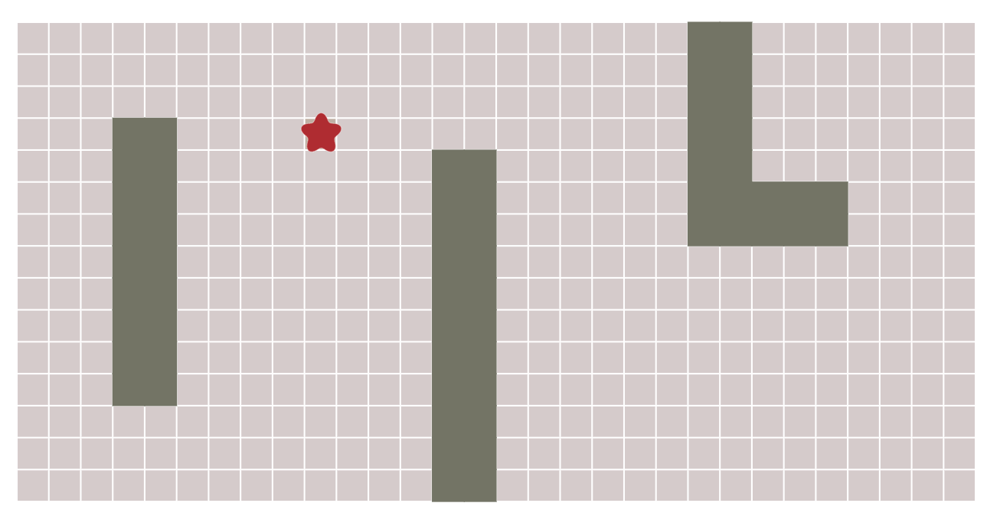

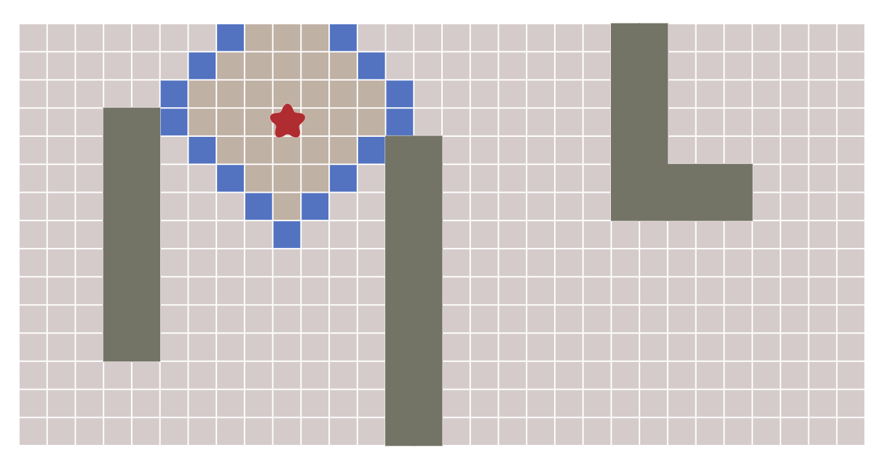

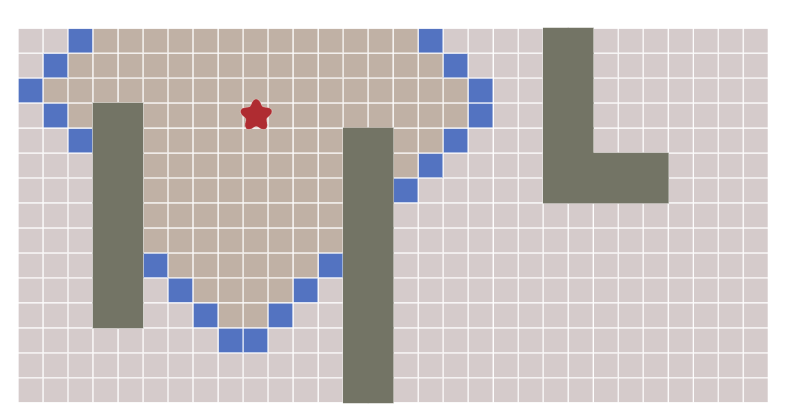

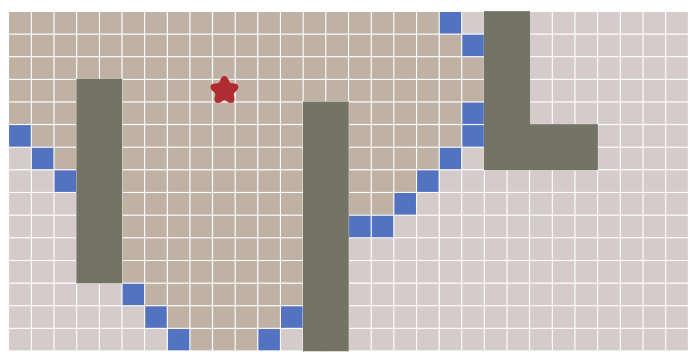

如何实现这个过程呢？重复下面这些步骤，直到边界为空：

1. 从边界列表中选择并移除一个节点
2. 通过寻找它的相邻节点来扩展它。任意一个尚未寻找过的相邻节点，都要将其添加到边界列表中，同时将其添加到寻找过的列表中

让我们近距离看一下。图块按照我们访问它们的顺序编号。逐步查看扩展过程：

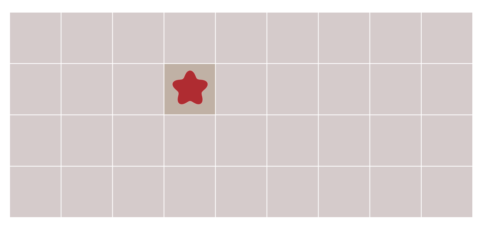

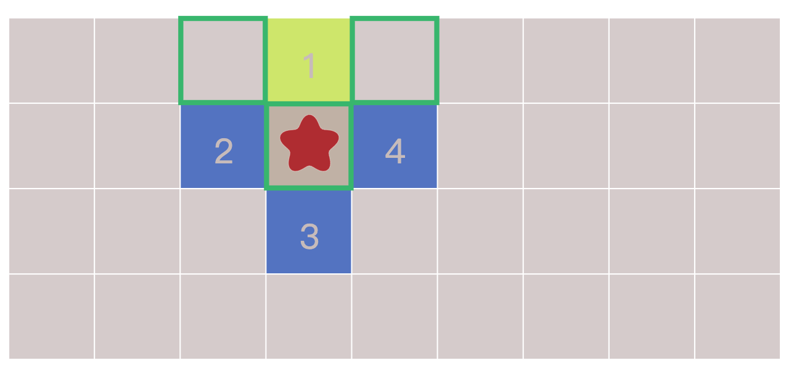

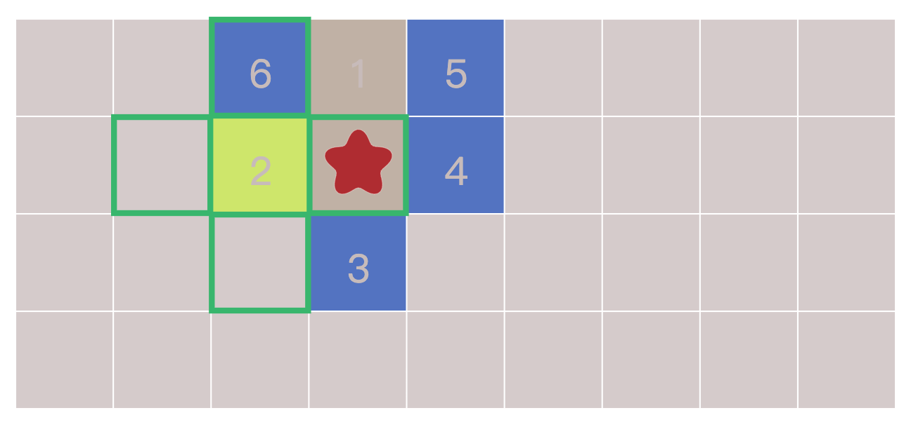

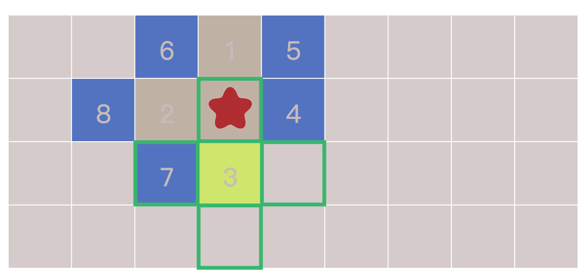

仅仅只需要10行代码（Python）便可以做到：

```python
frontier = Queue()
frontier.put(start)
visited = {}
visited[start] = True

while not frontier.empty():
   current = frontier.get()
   for next in graph.neighbors(current):
      if next not in visited:
         frontier.put(next)
         visited[next] = True
```

这个循环是本文所介绍的图搜索算法的本质，包括 A*。但是，我们如何找到最短的路径呢？循环实际上并没有构造路径；它仅告诉我们如何访问地图上的任意位置。这是因为，广度优先搜索不仅可以用于查找路径，还有很多其他用途。在本文中，我将展示它如何用于塔防游戏中，除此之外，它还可以用于距离图，过程式图生成，以及许多其他功能。这里由于我们要使用它来查找路径，所以让我们修改循环以跟踪每个访问过的位置的来源（从哪个节点访问到它），并将访问过的集合重命名为`came_from`表（表的键是访问过集合）

```python
frontier = Queue()
frontier.put(start)
came_from = {}
came_from[start] = None

while not frontier.empty():
   current = frontier.get()
   for next in graph.neighbors(current):
      if next not in came_from:
         frontier.put(next)
         came_from[next] = current
```

现在，每一个位置的`came_from`都指向它们的来源。这些就像泥土路上的“面包屑”，它们足以重建整条路径。

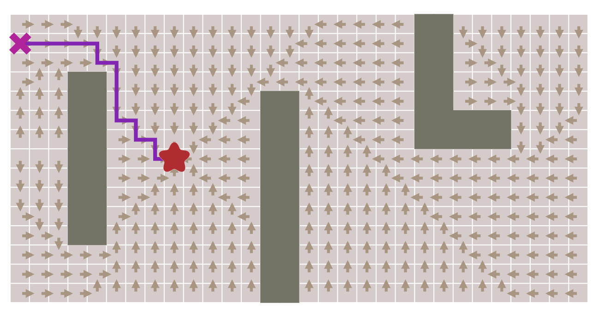

重建路径的代码很简单：遵循箭头的方向反向从目标点到起点。路径是一系列边，但通常存储节点更容易：

```python
current = goal
path = []
while current != start:
   path.append(current)
   current = came_from[current]
path.append(start) # optional
path.reverse() # optional
```

这是最简单的寻路算法。它不仅适用于上图所示的网格组成的地图，还适用于任何类型的图数据结构。在地牢中，图中的位置可以是房间，而图中的边则是位于它们之间的走道。在平台游戏中，图中的位置可以是游戏世界中的位置，而图中的边，它们是可能的动作，例如向左移动，向右移动，向上跳跃，向下跳跃。通常，将图视为状态和更改状态的动作。[这里](http://theory.stanford.edu/~amitp/GameProgramming/MapRepresentations.html)有更多关于地图表示法的文章。在本文的其余部分，我将继续使用网格图示例，并探讨为什么你可能会使用广度优先搜索的变体。


未完待续......