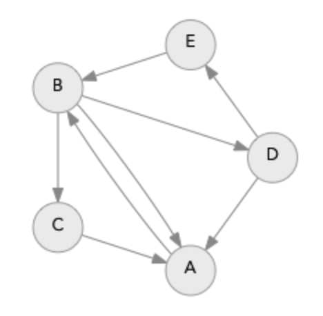

# A* 算法实现

原文地址：https://www.redblobgames.com/pathfinding/a-star/implementation.html

前文：[A*算法介绍](https://github.com/yangruihan/Notes/blob/master/GameDevelopment/GameDevelop/AStar%E7%AE%97%E6%B3%95%E4%BB%8B%E7%BB%8D.md)

----------分割线----------

>这篇文章是我对[A*介绍](https://www.redblobgames.com/pathfinding/a-star/introduction.html)的配套指南，其中我解释了算法的工作原理。本文我将展示如何实现广度优先搜索、Dijkstra 算法、贪心最佳优先搜索和 A* 算法。我尝试保持代码简洁。

图搜索有一系列相关算法。算法有很多变体，实现上也有很多变体。将本文展示的代码视为一个起点，而不是适用于所有情况的最终版本。

## 1 Python 实现

我将解释下面的大多数代码。你可以在 Implementation.py 中找到一些额外的内容。它们使用 Python3 编写而成，因此如果你使用 Python2，则需要将`super()`调用和`print`函数等内容转换成 Python2 的语法。

### 1.1 广度优先搜索（Breadth First Search）

让我们使用 Python 实现广度优先搜索。虽然文章主要展示用于搜索算法的 Python 代码，但我们首先需要定义图这个数据结构，以便算法执行。下面是我将要使用的抽象：

- **图（Graph）**

    一种数据结构：可以告诉我图中每个位置的相邻位置（参看这篇[文章](https://www.redblobgames.com/pathfinding/grids/graphs.html)）。加权图还可以告诉我沿着边移动的成本。

- **位置（Locations）**

    一个简单值（整数、字符串、元祖等），用于标记图中的位置。它们不一定是具体地图上的某些位置。根据解决的问题，它们还可能包含其他信息，例如方向、燃料、库存等。

- **搜索（Search）**

    一种算法：它接受一个图、一个起始位置以及一个目标位置（可选），并为图中的某些位置甚至所有位置计算出一些有用的信息（是否可访问，它的父指针，之间的距离等）。

- **队列（Queue）**

    搜索算法中用来确定处理图中位置顺序的数据结构。

本文的主要部分，我将专注于搜索算法。在余下的部分，我将逐步填充细节，最终得到一个完整工作的程序。让我们从图开始：

```python
class SimpleGraph:
    def __init__(self):
        self.edges = {}
    
    def neighbors(self, id):
        return self.edges[id]
```

没错，以上就是我们所需的全部代码了！你可能会问：节点（Node）对象在哪里呢？答案是：我很少使用节点对象。我发现使用整数、字符串或元祖来表示位置，然后使用将位置作为索引的数组和哈希表更简单方便。

请注意，边是有方向的：我们可以有一条从A到B的边，但没有从B到A的边。在游戏地图中，大多数情况边都是双向的，但有时也会有单向门或悬崖峭壁用单向边表示。让我们做一个示意图，其中位置为A-E：



对于每一个位置，我需要一个列表来表示它能到达的节点

```python
example_graph = SimpleGraph()
example_graph.edges = {
    'A': ['B'],
    'B': ['A', 'C', 'D'],
    'C': ['A'],
    'D': ['E', 'A'],
    'E': ['B']
}
```

在我们可以使用搜索算法来处理它之前，我们需要实现一个**队列（Queue）**：

```python
import collections

class Queue:
    def __init__(self):
        self.elements = collections.deque()
    
    def empty(self):
        return len(self.elements) == 0
    
    def put(self, x):
        self.elements.append(x)
    
    def get(self):
        return self.elements.popleft()
```

该队列类只是内置的`collections.deque`类的包装。不用担心在你的代码中直接使用`deque`（译注：这正是 Python 方便之处）。

让我们尝试使用`Queue`和广度优先搜索算法来处理上文中的示例图：

```python
from implementation import *

def breadth_first_search_1(graph, start):
    # print out what we find
    frontier = Queue()
    frontier.put(start)
    visited = {}
    visited[start] = True
    
    while not frontier.empty():
        current = frontier.get()
        print("Visiting %r" % current)
        for next in graph.neighbors(current):
            if next not in visited:
                frontier.put(next)
                visited[next] = True

breadth_first_search_1(example_graph, 'A')
```

```
运行结果：
Visiting 'A'
Visiting 'B'
Visiting 'C'
Visiting 'D'
Visiting 'E'
```

