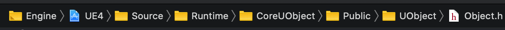
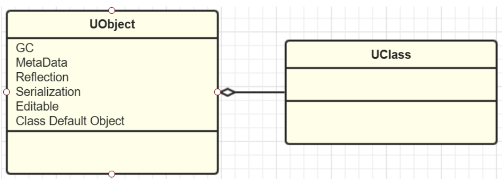
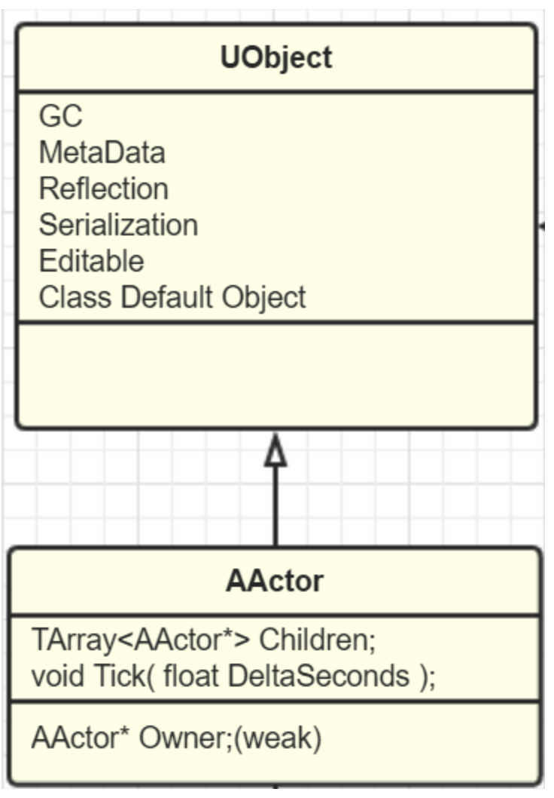
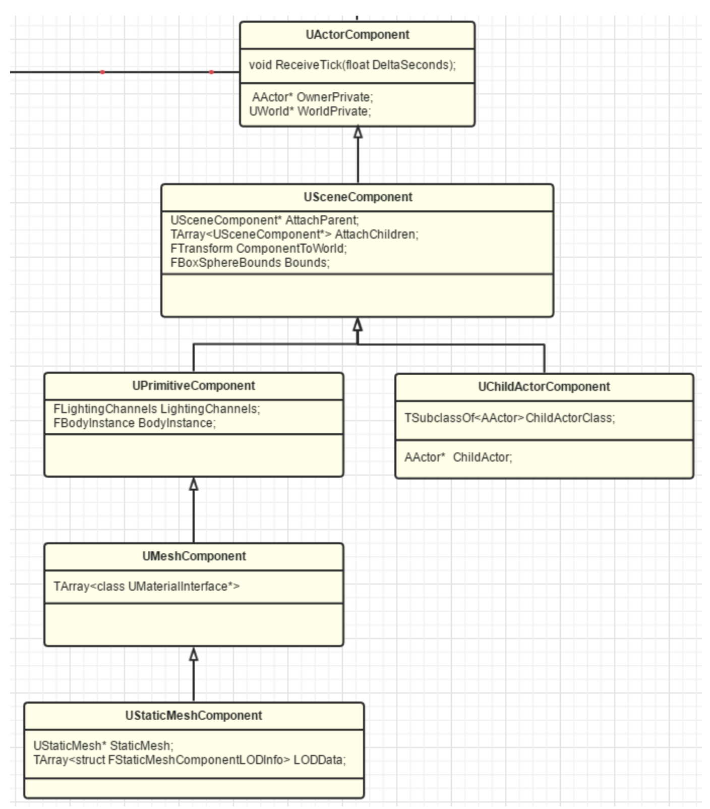
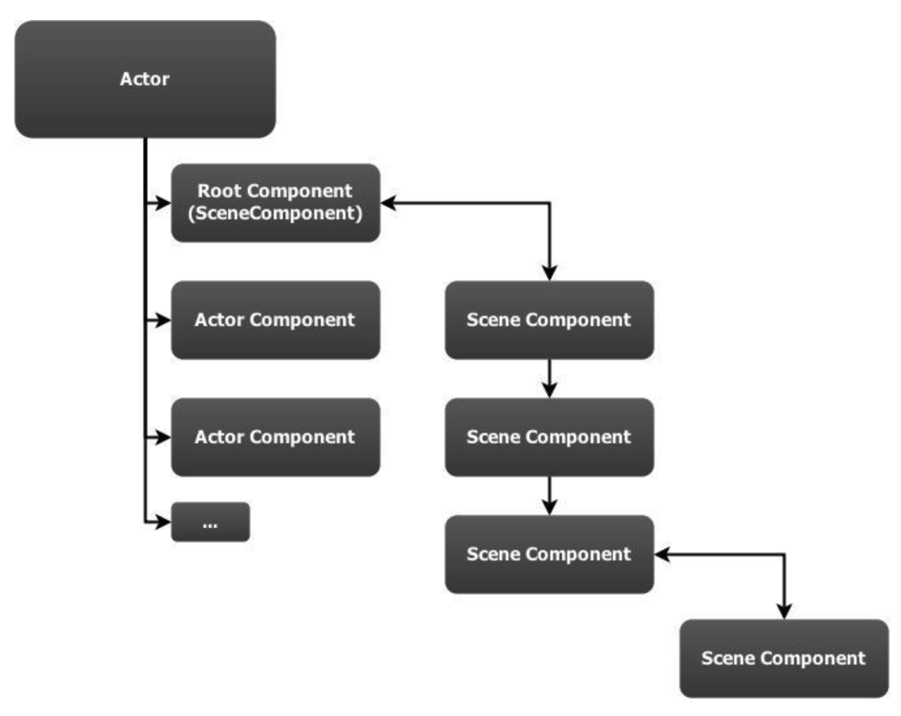
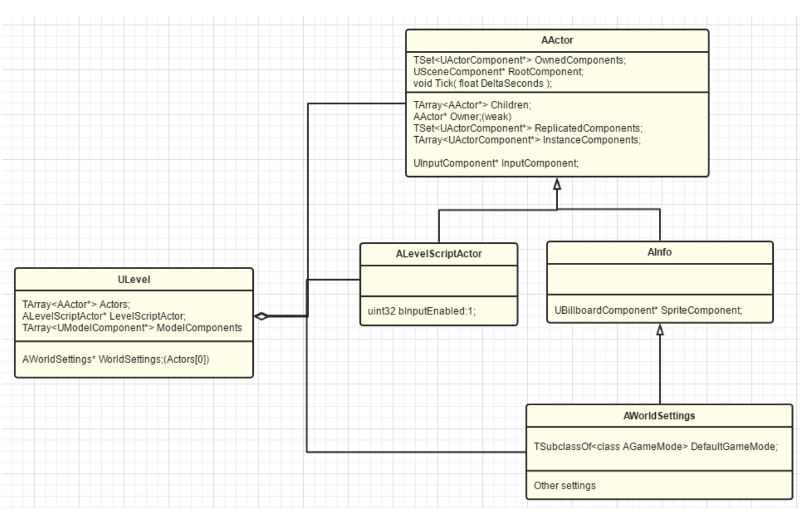
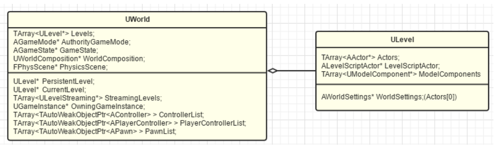
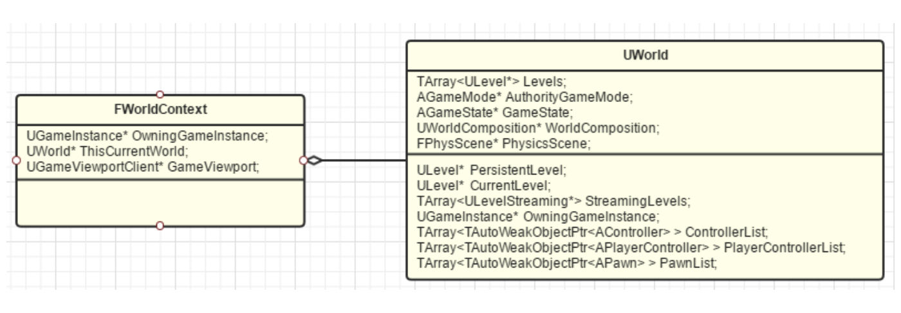
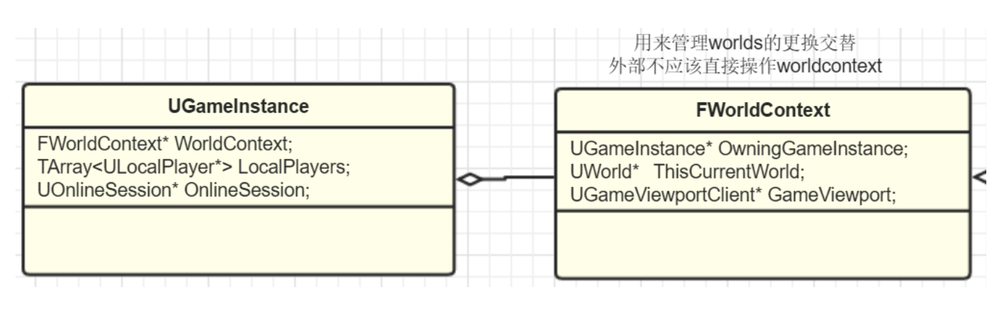
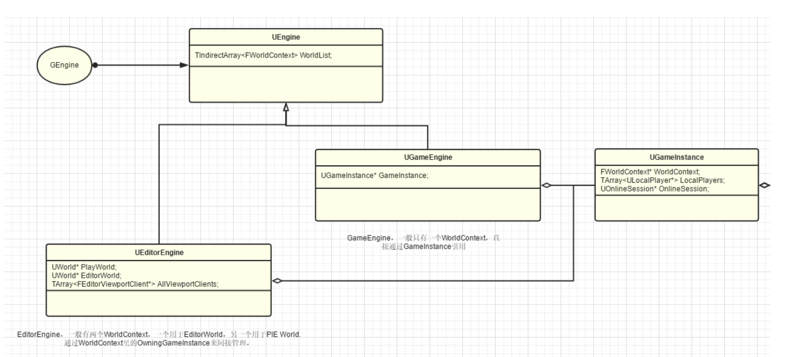

# UnrealEngine学习笔记

注：部分图片来自知乎专栏[《InsideUE4》](https://zhuanlan.zhihu.com/p/22924838)，侵删

## GamePlay架构

### UObject



UObject 为 UE 对象的基类，提供元数据、反射生成、GC垃圾回收、序列化、编辑器可见等



### AActor


AActor 为 UE 中的万千“演员”基类，提供 Replication（网络复制）、Spawn（生成和销毁），Tick（更新） 等功能



最常见的有`StaticMeshActor`, `CameraActor`和 `PlayerStartActor`等。Actor 之间还可以互相“嵌套”，拥有相对的“父子”关系

### UActorComponent

UActorComponent 也是继承于 UObject 的一个子类，一个 Actor 若想可以被放进 Level 里，就必须实例化 USceneComponent* RootComponent，SceneComponent 提供了两大能力：一是 Transform，二是 SceneComponent 的互相嵌套





### ULevel

关卡对应的是 .map 文件，用来保存各种 Actor，如下图



其中：

ALevelScriptActor 允许我们在关卡里编写脚本，关卡蓝图实际上就代表着关卡的运行规则

AInfo 记录着本关卡的各种规则属性

AWorldSettings 保存当前关卡的一些设置项

Level 作为 Actor 的容器，同时也划分了 World，一方面支持了 Level 的动态加载，另一方面也允许了团队的实时协作，大家可以同时并行编辑不同的 Level

### World

每个 World 支持一个 PersistentLevel 和多个其他 Level



### WorldContext

UE 中 World 不止一个，切不止一种类型

```
namespace EWorldType
{
	enum Type
	{
		None,		// An untyped world, in most cases this will be the vestigial worlds of streamed in sub-levels
		Game,		// The game world
		Editor,		// A world being edited in the editor
		PIE,		// A Play In Editor world
		Preview,	// A preview world for an editor tool
		Inactive	// An editor world that was loaded but not currently being edited in the level editor
	};
}
```

UE 用来管理和跟踪这些 World 的工具就是 WorldContext



### GameInstance

GameInstance 里会保存着当前的 WorldConext 和其他整个游戏的信息



### Engine

