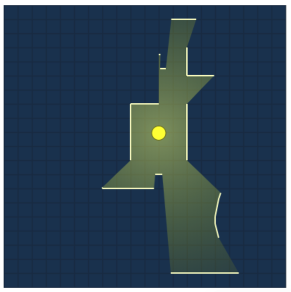
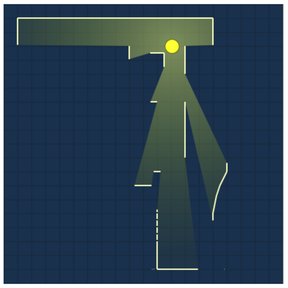
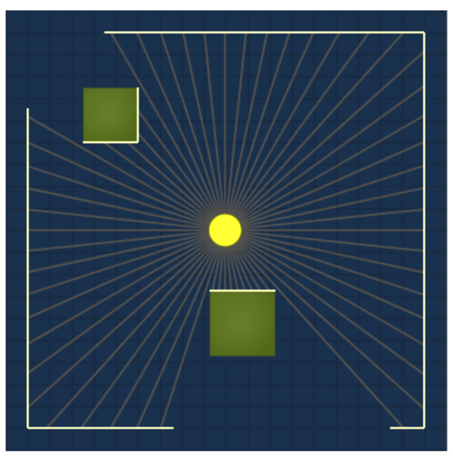
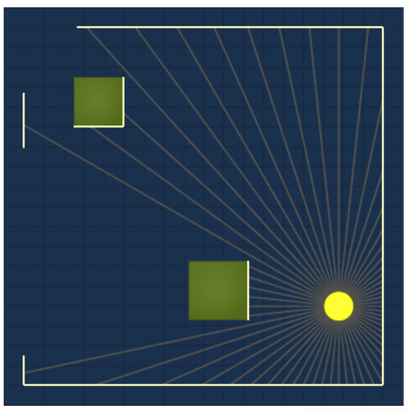
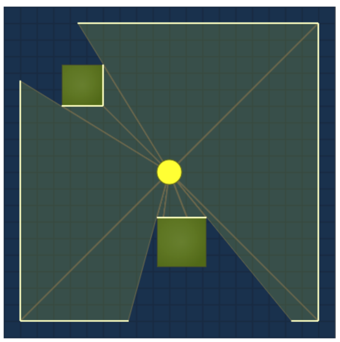
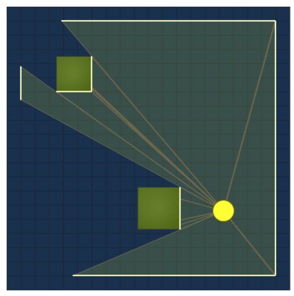

# 【翻译】2D 可见性

## 声明

原文地址：https://www.redblobgames.com/articles/visibility/

原作者：[Red Blob Games](https://www.redblobgames.com/)

已获得原作者授权

## 正文

在一张 2D 俯视角地图中，从给定点出发计算哪些位置可见有时是非常有用的。比如说你可能想隐藏某些从主角位置看不到的东西，又或者你想知道手电筒将照亮哪些区域。

该算法还可以用来计算给定一个光源，哪些区域将被照亮。对每个光源运行一次，我们可以构建一张光照贴图（light map）来展示哪些区域将被照亮。

Roguelike 社区收集了[好几种算法](http://www.roguebasin.com/index.php?title=Field_of_Vision)，特别是对于网格图（grids）来说（参考这篇[文章](http://www.adammil.net/blog/v125_Roguelike_Vision_Algorithms.html)）。减法算法（subtractive algorithms）从所有可见的事物开始，然后减去需要隐藏的区域。加法算法（additive algorithms）从所有不可见开始，然后添加可见区域。我将介绍一种可以与线段一起使用的加法算法，它不仅适用于区块或网格地图。

### 射线扫描

一种简单的方法是从中心点发出若干射线。这是为了获得大致答案合理的第一步：

更智能一点，让我们仅从墙体（障碍物）开始或结束的角投射光线。这些射线产生的三角形是可见区域：

仅此而已！让我们总结一下这个算法：

1. 计算墙体（障碍物）开始或结束的角
2. 从中心沿每个角投射射线
3. 填充由这些射线组成的三角形

### 墙体（障碍物）追踪

我们可以收工了，特别是如果我们有一个使用空间哈希避免与每面墙相交的快速射线投射算法。然而，一种更有效的方法是将射线投射和墙体相交组合成一个算法。