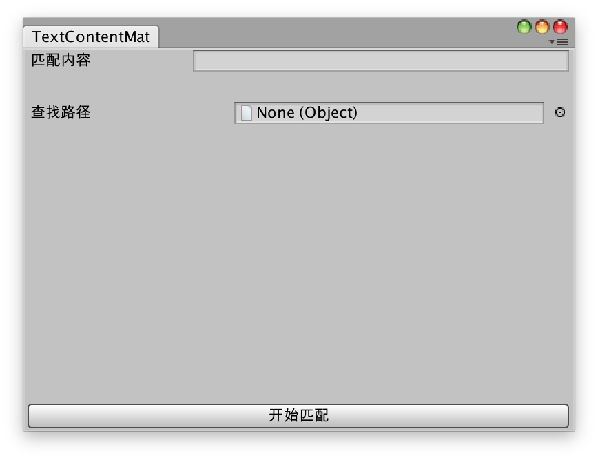

# Unity3d 工具分享——uGUI Text组件文本匹配

在实现游戏UI的时候，有时会遇到这样的需求，把所有文本包含 “你好” 的Text组件的字体改为 20 号，这时，为了高效与正确，很自然地会想到使用脚本去帮我们解决这一问题，下面便来实现一个满足需求的脚本。

## 需求说明

首先明确下我们的需求，我们需要一个工具，这个工具拥有界面，上面有一个输入框和一个目录栏，下面有一个“开始匹配”的按钮，当我们点击“开始匹配”按钮时，代码会根据输入框中的内容，在制定目录下对所有的 prefab 进行扫描，判断其拥有的 Text 组件是否包含输入框中的内容，如果包含，则进行我们需要的操作。

## 开始编码

创建`TextContentMatchUtil.cs`脚本，由于这是一个工具性的脚本，我们将其放在 Editor 目录下，这样 Unity 就会自动将其识别为 Editor 脚本。并且我们需要它继承自`EditorWindow`，这样它就可以显示出一个窗口。

初始代码如下所示：

```C#
using System.Collections;
using System.Collections.Generic;
using UnityEditor;
using UnityEngine;

public class TextContentMatchUtil : EditorWindow
{
    [MenuItem("Tools/Text组件内容匹配")]
    public static void ShowWindow()
    {
        var window = GetWindow<TextContentMatchUtil>();
        window.Show();
    }
}
```

其中 MenuItem 注解可以帮助我们在 Unity 菜单栏上生成对应的菜单项，此时，我们点击 Unity 菜单栏上的 Tools -> Text组件内容匹配，会出现一个空白的窗口，接下来我们要在 OnGUI 方法中绘制出我们需要的界面。

```c#
private void OnGUI()
{
    // 水平布局
    GUILayout.BeginHorizontal();
    // 显示标签
    GUILayout.Label("匹配内容");
    // 显示输入框，并且把输入内容赋值给 _matchContent
    _matchContent = EditorGUILayout.TextField(_matchContent);
    GUILayout.EndHorizontal();
	
    GUILayout.Space(20);

    // 显示对象选择框，这里用来选择目录，并把内容赋值给 _matchFolder
    _matchFolder = EditorGUILayout.ObjectField("查找路径", _matchFolder, typeof(Object));

    GUILayout.FlexibleSpace();

  	// 显示按钮，如果点击该按钮，返回值为 true，输出“开始匹配”
    if (GUILayout.Button("开始匹配"))
    {
        Debug.Log("开始匹配");
    }
}
```

由于注释比较详细，这里就不细说了，实现效果如下：



接下来的代码才是关键，第一步我们要得到查找路径下的所有 Prefab。

```c#
private static List<GameObject> LoadDiectoryPrefab(string rootPath)
{
    var dictoryInfo = new DirectoryInfo(rootPath);
    if (!dictoryInfo.Exists) return null;

    var ret = new List<GameObject>();
    // 得到该目录下的所有 Prefab 文件
    FileInfo[] fileInfos = dictoryInfo.GetFiles("*.prefab", SearchOption.AllDirectories);

    // 显示进度条
    EditorUtility.DisplayProgressBar("加载Prefab中...", "开始加载", 0f);

    int i = 0;
    // 遍历所有文件
    foreach (FileInfo files in fileInfos)
    {
        string path = files.FullName;

        // 将文件绝对路径改成 Unity 资源相对路径，形如 Assets/xxx/xxx

#if UNITY_STANDALONE_WIN
        string assetPath = path.Substring(path.IndexOf("Assets\\"));
#else
        string assetPath = path.Substring(path.IndexOf("Assets/"));
#endif

        // 更新进度条
        EditorUtility.DisplayProgressBar("加载Prefab中...", assetPath, ++i * 1.0f / fileInfos.Length);

        // 通过路径加载 Prefab
        GameObject prefab = AssetDatabase.LoadAssetAtPath<GameObject>(assetPath);
        // 将 Prefab 加到结果列表中
        ret.Add(prefab);
    }

    // 加载完毕，关闭进度条
    EditorUtility.ClearProgressBar();

    // 返回结果
    return ret;
}
```

代码也比较简单，思路就是得到指定目录下所有的 .prefab 文件，拼装成 Unity 资源相对路径，再调用`AssetDatabase.LoadAssetAtPath`将其加载进来。

这么一来我们就得到了搜索路径下的所有 Prefab，接下来遍历所有 Prefab，得到其拥有的所有 Text 组件，再一一进行匹配就好了，代码如下：

```c#
private void StartMatch()
{
    var foldPath = Application.dataPath + AssetDatabase.GetAssetPath(_matchFolder).Replace("Assets", "");
    var prefabs = LoadDiectoryPrefab(foldPath);

    // 显示进度条
    EditorUtility.DisplayProgressBar("匹配Prefab中...", "开始匹配", 0f);
    int i = 0;
    foreach (var prefab in prefabs)
    {
        // 更新进度条
        EditorUtility.DisplayProgressBar("匹配Prefab中...", prefab.name, ++i * 1.0f / prefabs.Count);

        var textComponents = prefab.GetComponentsInChildren<Text>();
        foreach (var textComponent in textComponents)
        {
            if (textComponent.text.Contains(_matchContent))
            {
                Handle(textComponent);
            }
        }
    }

    // 匹配完毕，关闭进度条
    EditorUtility.ClearProgressBar();
}

private void Handle(Text text)
{
    Debug.Log(string.Format("--- 处理 {0}[{1}] ---", text.gameObject.transform.root.name, text.gameObject.name));

    text.fontSize = 20;
}
```

到这里，我们想要的功能都已经实现了。


整个代码都很简单、直观，不仅如此，`Handle`方法还可以添加任意你需要的逻辑，比如更改文字颜色，添加自定义脚本等。

## 不足与扩展

- 代码中文字匹配直接调用了系统的`Contains`方法，显然不够准确也不够强大，未来可以扩展支持**[正则表达式](https://zh.wikipedia.org/wiki/%E6%AD%A3%E5%88%99%E8%A1%A8%E8%BE%BE%E5%BC%8F)**。
- `Handle`方法不够灵活，不容易扩展，可以使用**[策略模式](https://zh.wikipedia.org/zh-hans/%E7%AD%96%E7%95%A5%E6%A8%A1%E5%BC%8F)**或其他方法来进行优化。
- 对处理结果的展示不够完善，可以根据需要生成对应报表来展示处理结果。
- ……（欢迎补充）


最后，这里查看**[完整代码](https://gist.github.com/yangruihan/f18d18fbdc6a74297fdde986414683b9)**